author: Equipo de instructores FDP
summary: Primera práctica de laboratorio FDP
id: laboratorio-1-fdp-0222
tags: workshop,iguide
categories: C
environments: Visual Studio Code
status: Published
feedback link: A link where users can go to provide feedback (e.g. the git repo or issue page)

# Fundamentos de Programación: Laboratorio 1

## Introducción
Duration: 0:02:00

En esta guía se describen los pasos para instalar el software que será utilizado en la materia, para editar,
compilar y ejecutar los programas de computadora que serán elaborados en clase, en las sesiones de Laboratorio, durante los exámenes y en las tareas. El lenguaje a utilizar es C/C++ y el entorno de desarrollo de programas es el Visual Studio Code. Ambos son gratuitos y se encuentran en servidores del Internet. Para tenerlos listos en sus computadoras se realizarán los siguientes pasos:

+ Descarga compilador de C/C++, instalación de dicho compilador y configuración de una variable de entorno del sistema operativo.
+ Descarga de Visual Studio Code, instalación de dicho entorno de desarrollo y configuración de algunas facilidades.

## Descargando el compilador
Duration: 0:03:00

Desde su navegador de Internet acceda al sitio https://sourceforge.net/projects/mingw/files.
Aparecerá una página similar a la siguiente:

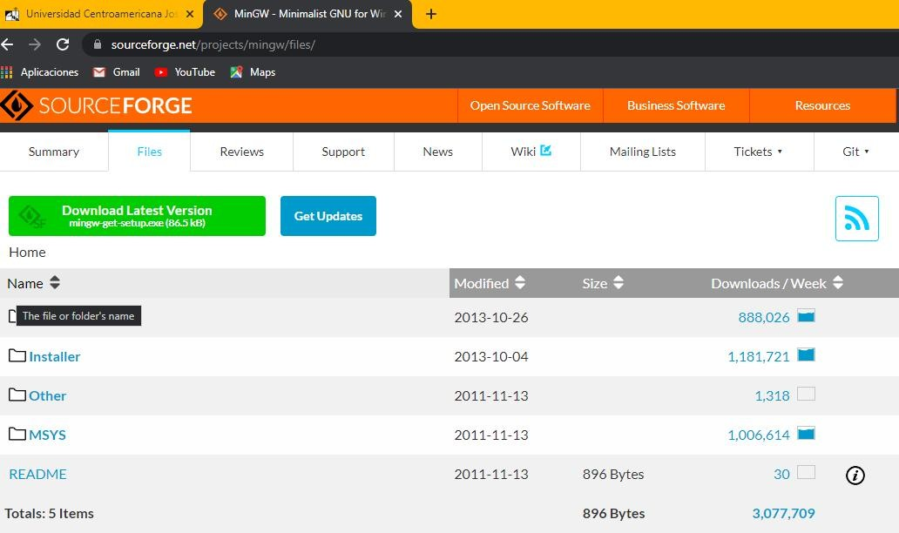

Pulse el botón en el que se lee ***Downolad Latest Version***. Esto iniciará el proceso de descarga del archivo ejecutable ***mingw-get-setup.exe*** (o similar).

Este ejecutable descargará e instalará el compilador de C/C++.

Diríjase a la carpeta donde se ha descargado, muy probablemente es la carpeta de descargas de Windows. Verá algo similar a lo que se muestra en la siguiente figura:

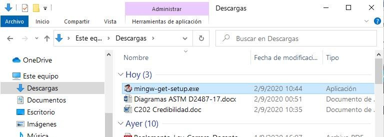

En este momento habrá terminado el proceso de descarga del compilador de C/C++.

## Instalando de compilador de C/C++ en su computadora
Duration: 0:10:00

Dé doble clic sobre el archivo recién descargado para iniciar su ejecución. Espere unos momentos mientras se realiza la descarga y se abre la ventana del proceso de instalación. Se verá similar a la siguiente:

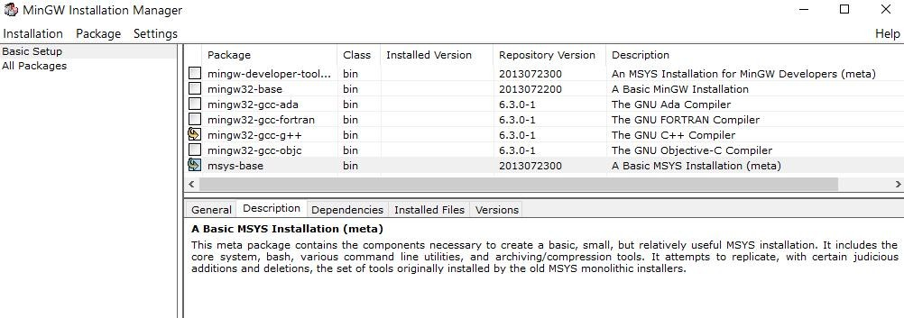

Cuando se abra el instalador tal vez tenga que pulsar algún par de botones para llegar a esta ventana en el proceso de instalación (cuando se le solicita la carpeta destino, elija la que se le sugiere). Pero, una vez ha llegado a esta ventana, elija instalar los paquetes ***mingw32-gcc-g++*** y ***msys-base***. Luego pulse la opción de menú ***Installation*** que se encuentra arriba y a la izquierda de esta ventana y luego seleccione la opción ***Apply Changes***. El proceso de instalación del compilador de C/C++ dará inicio, verá en una nueva ventana la lista de herramientas que se van instalando. Espere hasta que este proceso termine.

Cuando termine el proceso de instalación verá un mensaje indicando que este ha sido exitoso ***All changes were applied successfully; you may now close this dialogue***.

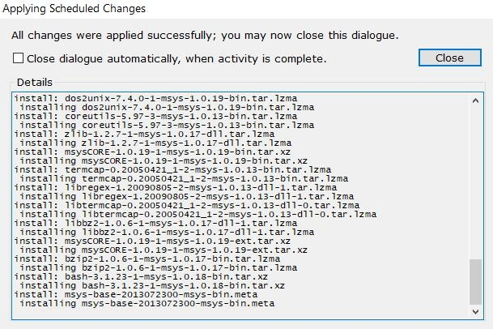

Pulse el botón ***Close*** y luego cierre la ventana de instalación.

El proceso de instalación de C/C++ habrá finalizado. Puede verificarlo revisando el contenido del disco duro con ayuda del explorador de archivos. Verá la carpeta ***MinGW*** en su disco y las sub carpetas que están detrás de ella.

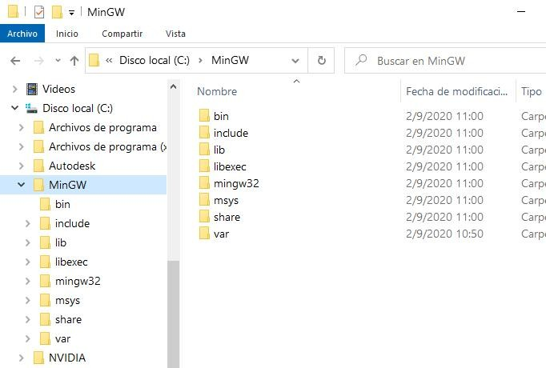

En este momento habrá terminado el proceso de instalación del compilador de C/C++.

## Configurando una variable de entorno del sistema operativo Windows
Duration: 0:06:00

En su Explorador de Archivos pulse la carpeta ***bin*** que se encuentra detrás de la carpeta ***MinGW***. En la parte superior del Explorador de Archivos verá una barra donde aparece el texto ***MinGW > bin***. Con el puntero del ratón señale esta barra y dé clic derecho. Aparecerá un menú contextual. Pulse la opción ***Copiar dirección como texto*** de este menú, tal y como se ve en la siguiente figura:

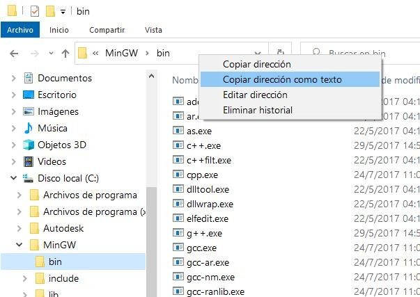

Ahora va a dirigirse a la ventana que le permite la configuración de la variable de entorno ***Path***, del sistema operativo Windows. Para ello debe abrir la ventana de ***Propiedades del sistema***. Si tiene Windows 10 escriba en la parte inferior ***variables de entorno***, tal y como se muestra en la siguiente figura:

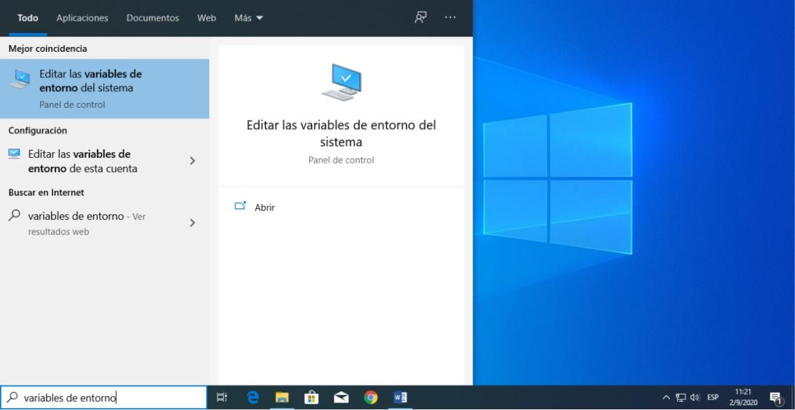

Se abrirá la ventana de edición de variables de entorno del sistema operativo:

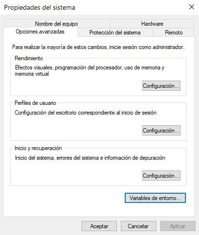

En la pestaña de ***Opciones avanzadas*** pulse el botón ***Variable de entorno*** que se encuentra hasta abajo. Aparecerá una ventana como la siguiente:

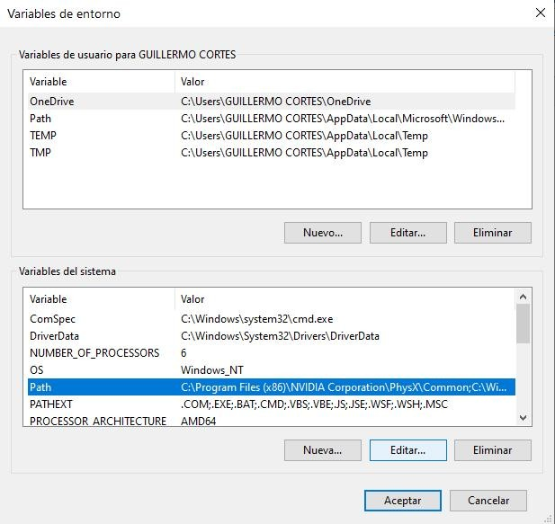

Dé clic sobre la variable ***Path*** que está en la sección de ***Variables del sistema*** (parte baja de la ventana) y luego pulse el botón ***Editar***. Aparecerá una ventana que le permitirá editar la variable de entorno, como se muestra en la siguiente figura:

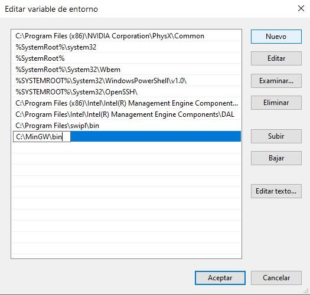

En esta ventana pulse el botón ***Nuevo***. Se abrirá un espacio abajo y luego colóquese en ese espacio y pegue la ruta que copió como texto, tal y como se ve en la figura.

Pulse ***Aceptar*** para cerrar esta ventana y luego pulse ***Aceptar*** para cerrar la ventana de ***Variables de entorno***.

En este momento habrá terminado la configuración de la variable de entorno ***Path***.

## Adquisición y preparación de Visual Studio Code
Duration: 0:05:00

### Descargando el instalador
En su navegador de Internet escriba ***Visual Studio Code*** para realizar la búsqueda de este entorno de programación. Aparecerá algo similar a lo que se muestra en la siguiente figura:


Elija el enlace que dice ***Download***. Aparecerá una página con diferentes opciones de descarga, como se muestra en la siguiente figura:

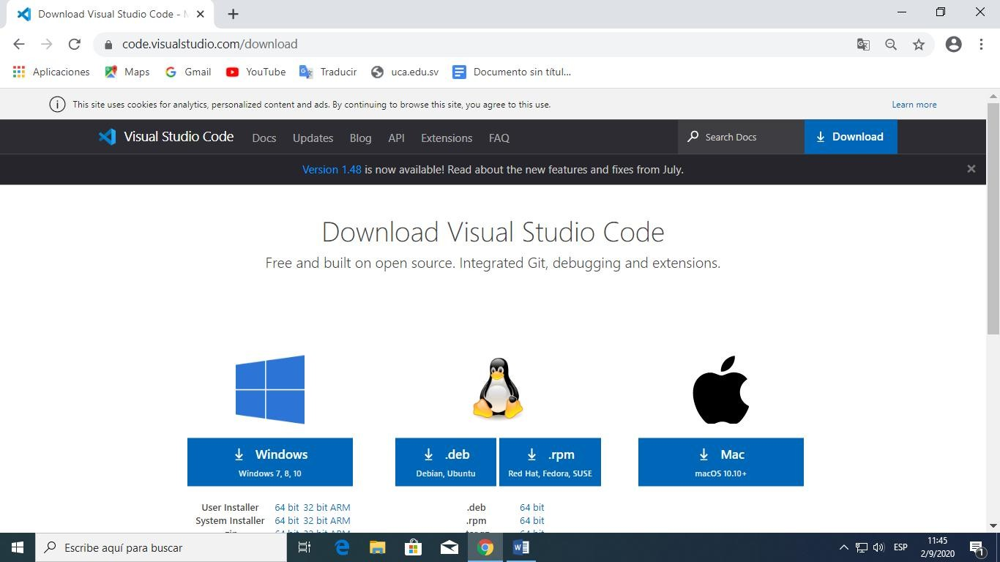

Elija descargar	para su	***Windows***. Se iniciará el proceso de descarga del archivo ejecutable
***VSCodeUserSetup-x64-1.48.2.exe*** (o similar).

Cuando haya terminado el proceso de descarga del instalador abra, desde el Explorador de Archivos, la carpeta de descargas de su computadora, verá algo similar a la siguiente figura:

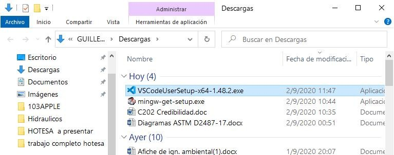

En este momento habrá terminado el proceso de descarga del instalador de Visual Studio Code.

## Instalación de Visual Studio Code
Duration: 0:05:00
Dé doble clic en el archivo que acaba de descargar para iniciar el proceso de instalación. En la ventana que aparece elija la opción ***Acepto el acuerdo*** y luego pulse el botón ***Siguiente***.

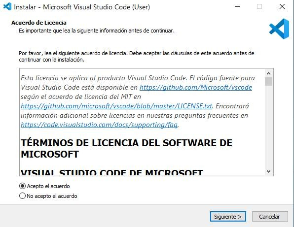

Se le pedirá la ruta de instalación en su máquina. A partir de aquí solo pulse la opción ***Siguiente*** cuando aparezca.

Pulse el botón ***Siguiente*** para aceptar la ruta de instalación sugerida.

Se le pedirá el nombre de la carpeta del Menú Inicio. Pulse el botón ***Siguiente*** para aceptar la opción sugerida.

Se le pedirá si quiere que aparezca un botón de acceso directo al Visual Studio Code en el Escritorio de su computadora. Elija esta opción y pulse de nuevo el botón ***Siguiente***.

Finalmente, pulse el botón ***Instalar***. El proceso de instalación comenzará y cuando termine pulse el botón ***Finalizar***.
 
Se abrirá la ventana de Visual Studio Code. Si no aparece, entonces dé doble clic en el botón de acceso directo que está en el escritorio o búsquelo en el menú Inicio de su sistema operativo.


Verá abrirse la ventana del Visual Studio Code, como se muestra en la siguiente figura.

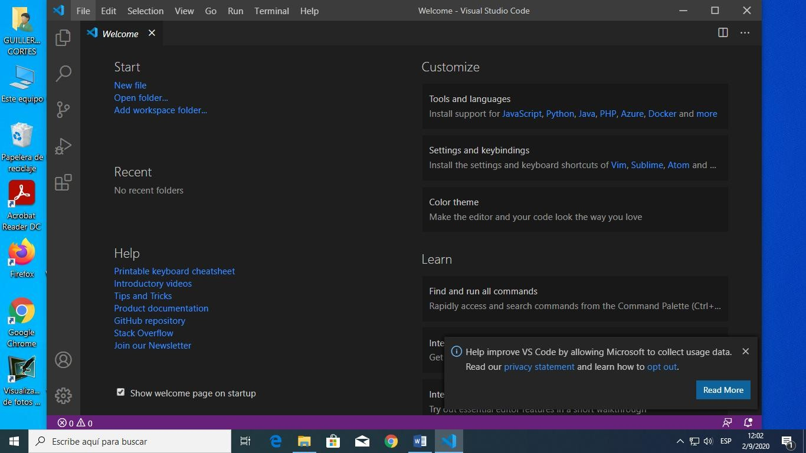

En este momento habrá terminado el proceso de instalación de Visual Studio Code.

## Configuración de algunas facilidades del entorno de Visual Studio Code
Duration: 0:10:00

Realizaremos cuatro configuraciones dentro del entorno de Visual Studio Code. Las primeras tres de ellas tienen el mismo proceso de configuración.

Cierre la pestaña ***Welcome*** pulsando la X. Luego pulse el botón:


Este botón se encuentra en una barra lateral ubicada a la izquierda de la ventana de Visual Studio Code. Nos ayuda a instalar Extensiones que facilitan el trabajo en el entorno.

Aparecerá la siguiente ventana:

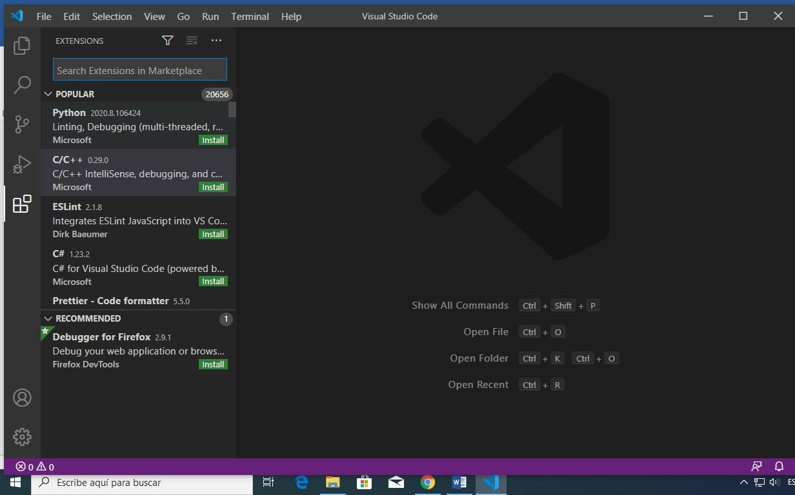

Puede ver arriba la etiqueta ***Extensions*** y una caja de búsqueda de extensiones inmediatamente abajo de esta etiqueta.

En esta caja de búsqueda digite ***Code Runner*** y aparecerá lo siguiente:

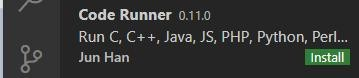

Pulse el botón ***Install*** de esta extensión para hacer que empiece su proceso de instalación. Cuando finalice, este botón se habrá cambiado por un pequeño engranaje, como puede ver en la siguiente figura:

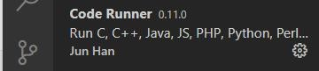

Esta extensión coloca el botón de ejecución de programas arriba a la derecha de la ventana del Visual Studio Code. Es similar a un botón de play. Cuando escriba su primer programa podrá pulsar este botón para que su programa se ejecute. Tiene el siguiente aspecto:


En la caja de búsqueda digite ahora ***C/C++ Compile Run***. Aparecerá debajo, como se muestra en la siguiente figura:

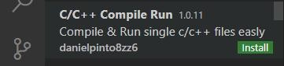

Pulse el botón ***Install*** de esta extensión para hacer que inicie su proceso de instalación. Cuando finalice aparecerá el engranaje.

En la caja de búsqueda digite ahora ***C/C++ IntelliSense***. Aparecerá debajo, como se muestra en la siguiente figura:

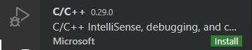

Pulse el botón ***Install*** de esta extensión para hacer que inicie su proceso de instalación. Cuando finalice aparecerá el engranaje.

Esta es una facilidad de auto completado de los comandos de C/C++ que usted escribe cuando esté editando programas.

La cuarta configuración dentro de Visual Studio Code es distinta a las anteriores. En la barra del menú principal, ubicada en la parte superior, pulse la opción ***File***. Luego, en el menú que se despliega pulse la opción ***Preferences*** y en el siguiente menú pulse la opción ***Settings***.

Aparecerá la pestaña de configuración con la etiqueta ***Settings*** e inmediatamente abajo una caja para realizar la búsqueda de la opción a configurar. En esta caja escriba ***Code-Runner: Run in Terminal***, como se ve en la siguiente figura:

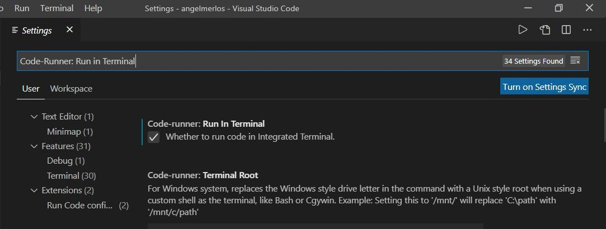

Cuando aparezca esa opción abajo, pulse dentro de la caja de selección para chequearla. Luego cierre esta pestaña de configuración pulsando en la **X** que aparece a la par de la etiqueta ***Settings***.

En este momento habrá terminado el proceso de configuración de Visual Studio Code.


## Introducción a codificación en C
Duration: 0:10:00

### int
Los int son tipos de datos que pueden contener valores enteros (positivos, negativos y cero), pero no valores decimales. Por ejemplo, 0, -5, 10.
```c
int id;
```
Aquí, id es una variable de tipo entero.

También es posible declarar múltiples variables a la vez en C, así:
```c
int id, edad;
```
El tamaño de int suele ser de 4 bytes (32 bits). 

<p>---------------------------------------------------------------------------------------------------------------</p>

### float y double
float y double se utilizan para contener números reales. Por ejemplo: 1.4, 5.9, 9.01.
```c
float salary;
double price;
```
En C, los números de punto flotante también se pueden representar en forma exponencial:
```c
float normalizationFactor = 22.442e2;
```
**¿Cuál es la diferencia entre float y double?**

El tamaño de float es de 4 bytes y tiene una precisión decimal más simple, mientras que el tamaño de double (tipo de datos flotante de doble precisión) es de 8 bytes y cuenta con mayor precisión decimal.

<p>---------------------------------------------------------------------------------------------------------------</p>

### char
La palabra clave char se emplea para declarar variables de tipo de carácter (su tamaño es de 1 byte). Por ejemplo: a, b, c, k, m.
```c
char letra = 'h';
```

<p>---------------------------------------------------------------------------------------------------------------</p>

### Void (vacío)
void es un tipo incompleto. Significa "nada" o "ningún tipo". Puedes pensar en void como ausente.
Por ejemplo, si una función no devuelve nada, su tipo de devolución debería ser void.

Ten en cuenta que no puedes crear variables de tipo void.

## Salidas y Entradas en C (Input/Output)

### Salida en C
Duration: 0:10:00
En programación C, printf() es una de las principales funciones de salida. La función envía una salida formateada a la pantalla.

**Ejemplo 1: Salida de texto**
```c
#include <stdio.h>
int main()
{
    //Los textos se escriben entre comillas " "
    printf("Hola Mundo");
    return 0;
}
```
**¿Cómo funciona este programa?**
+ Todos los programas en C válidos deben contener la función main(). 
+ La ejecución del código comienza desde el inicio de main().
+ printf() es una función de biblioteca para enviar una salida formateada a la pantalla.
+ La función imprime la cadena entre comillas.
+ Para usar printf() en nuestro programa necesitamos incluir stdio.h, un archivo de encabezado, usando la instrucción #include <stdio.h>.
+ La declaración de return 0 dentro de la función main() se entiende como el "Estado de salida" del programa (es opcional).

**Ejemplo 2: Imprimiendo una variable**
```c
#include <stdio.h>
int main()
{
    int numeroEntero = 5;
    printf("Numero = %d", numeroEntero);
    return 0;
}
```
Salida:<br>
Numero = 5

Usamos el especificador de formato %d para imprimir ints. Aquí, el %d dentro de las comillas (" ") será reemplazado por el valor de la variable numeroEntero.

**Ejemplo 3: Imprimiendo floats y doubles**
```c
#include <stdio.h>
int main()
{
    float numero1 = 13.5;
    double numero2 = 12.4;
    
    printf("numero 1 = %f\n", numero1);
    printf("numero 2 = %lf", numero2);
    return 0;
}
```
Salida:<br>
numero1 = 13.500000<br>
numero2 = 12.400000<br>

Para imprimir float usamos el especificador de formato %f. Del mismo modo, usamos %lf para imprimir valores double. (\n se utiliza para indicar un salto de línea).

**Ejemplo 4: Caracteres**
```c
#include <stdio.h>
int main()
{
    char letra = 'a';
    printf("letra = %c", letra);
    return 0;
}
```
Salida:<br>
letra = a

Para imprimir datos de tipo char usamos el especificador de formato %c.

### Entrada en C
En la programación C, scanf() es una de las funciones comúnmente utilizadas para recibir información del usuario. Esta función lee la entrada formateada de la entrada estándar, como los teclados.

**Ejemplo 5: Ingresando un entero**
```c
#include <stdio.h>
int main()
{
    int numeroEntero;
    printf("Ingresa un numero entero: ");
    scanf("%d", &numeroEntero);
    printf("El numero ingresado es %d", numeroEntero);
    return 0;
}
```
Salida:<br>
Ingresa un número entero: 4<br>
El numero ingresado es 4

Aquí hemos utilizado el especificador de formato %d dentro de la función scanf() para recibir un int de parte del usuario. Cuando el usuario ingresa un número entero, se almacena en la variable numeroEntero.

Ten en cuenta que hemos utilizado &numeroEntero dentro scanf(). Esto es porque &numeroEntero obtiene la dirección de numeroEntero, y el valor ingresado por el usuario se almacena en esa dirección.

**Ejemplo 6: Ingresando floats y doubles**
```c
#include <stdio.h>
int main()
{
    float numero1;
    double numero2;
    
    printf("Ingresa un numero: ");
    scanf("%f", &numero1);
    printf("Ingresa otro numero: ");
    scanf("%lf", &numero2);
    
    printf("numero 1 = %f\n", numero1);
    printf("numero 2 = %lf", numero2);
    
    return 0;
}
```
Salida:<br>
Ingresa un numero: 12.523<br>
Ingresa otro numero: 10.2<br>
numero 1 = 12.523000<br>
numero 2 = 10.200000

Usamos los especificadores de formato %f para float y %lf para double.

## Tabla de tipos de datos

| **Tipo**                   | **Tamaño (bytes)**                   | **Especificador de formato** |
| -------------------------- | ------------------------------------ | ---------------------------- |
| int                        | Almenos 2, generalmente 4            | %d, %i                       |
| char                       | 1                                    | %c                           |
| float                      | 4                                    | %f                           |
| double                     | 8                                    | %lf                          |
| short int                  | 2 por lo general                     | %hd                          |
| unsigned int               | Almenos 2, generalmente 4            | %u                           |
| long int                   | Almenos 4, generalmente 8            | %ld, %li                     |
| long long int              | Al menos 8                           | %lld, %lli                   |
| unsigned long int          | Al menos 4                           | %lu                          |
| unsigned long long int     | Al menos 8                           | %llu                         |
| signed char                | 1                                    | %c                           |
| unsigned char              | 1                                    | %c                           |
| long double                | Almenos 10, generalmente 12 o 16     | %LF                          |


## Ejercicios de laboratorio
Duration: 1:00:00

1. Crear un programa que muestre el texto "Hola Mundo", "Este es el primer laboratorio de Fundamentos de Programación", "La fecha de hoy es", en diferentes líneas.
2. Crear un programa en el que se declare una variable de cada tipo vista en el laboratorio, e imprimir el valor de la variable junto con un texto que lo describa. Por ejemplo: para la variable int miNumeroInt = 25; se debe mostrar un texto como "25 es un numero entero".
3. Crear un programa que, ingresado un número, realice las operaciones matemáticas (suma, resta, multiplicación, división) e imprima los resultados.
4. Crear un programa que convierta grados Celsius a Fahrenheit ((°C x 9/5) + 32) e imprima el resultado de la conversión.