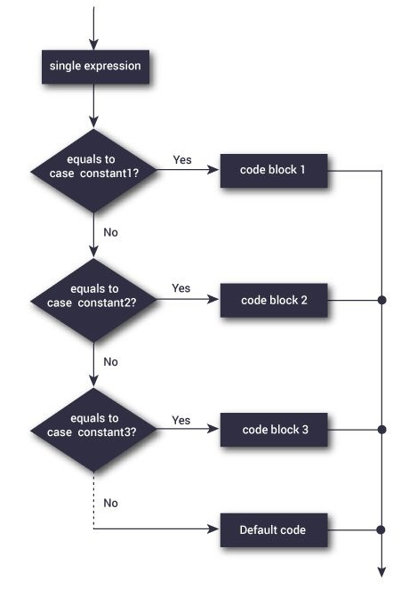

author: Equipo de instructores FDP
summary: Segunda práctica de laboratorio FDP
id: laboratorio-2-fdp-0222
tags: workshop,iguide
categories: C
environments: Visual Studio Code
status: Published
feedback link: A link where users can go to provide feedback (e.g. the git repo or issue page)

# Fundamentos de Programación: Laboratorio 2

## Introducción
Duration: 0:02:00


En este laboratorio se introducirá el uso de las funciones **if** y **else**, además de **switch** y su sintaxis correspondiente.

## Conceptos básicos de if
Duration: 0:10:00

### ¿Cómo funciona la declaración if?

La declaración <code>if</code> evalúa la expresión de prueba dentro del paréntesis (), dando lugar a dos escenarios:
1. Si la expresión de prueba (o condición) se evalúa como verdadera (***true***), entonces se ejecutan las instrucciones dentro del cuerpo del if.
2. Si la expresión de prueba (o condición) se evalúa como falsa (***false***), entonces las instrucciones dentro del cuerpo del if no se ejecutan.

#### Funcionamiento de la declaración if

Para obtener más información sobre cuándo la expresión de prueba (o condición) se evalúa como verdadera (valor distinto de cero) y cuándo se evalúa como falsa (0), consulte los operadores relacionales y lógicos.
<br>
<p>________________________________________________________________________</p>
<br>
<br>

**Ejemplo 1: declaración de if**

```c
// Este programa indica si un número ingresado es negativo

#include <stdio.h>
int main() {
    int numero; 

    printf("Introduzca un numero entero: ");
    scanf("%d", &numero);

    // La condición devolverá verdadero/true si el número es menor que 0
    if (numero < 0) {
        printf("%d es un numero negativo.\n", numero);
    }

    printf("Las instrucciones afuera del if se ejecutan.");

    return 0;
}
```

**Resultado con condición verdadera:**<br>
Introduzca un numero entero: -2<br>
-2 es un numero negativo.<br>
Las instrucciones afuera del if se ejecutan.<br>

Cuando el usuario ingresa -2, la expresión de prueba <code>numero < 0</code> se evalúa como verdadera; por esa razón se muestra en pantalla el mensaje declarado dentro del cuerpo del **if**.

<p>________________________________________________________________________</p>

**Resultado con condición falsa:**<br>
Introduzca un numero entero: 5<br>
Las instrucciones afuera del if se ejecutan.<br>

Cuando el usuario ingresa 5, la expresión de prueba <code>numero < 0</code> se evalúa como falsa y la declaración dentro del cuerpo de if no se ejecuta.

## if...else

### ¿Cómo funciona if...else?
La declaración if puede tener un bloque de instrucciones opcional, <code>else</code>.

Si la expresión de prueba se evalúa como **verdadera**, entonces:
+ Se ejecutan las instrucciones dentro del cuerpo del **if**.
+ Todo lo que se encuentre dentro del cuerpo de **else** se omite de la ejecución.

Si la expresión de prueba se evalúa como **falsa**, entonces:
+ Todo lo que se encuentre dentro del cuerpo de **if** se omite de la ejecución.
+ Se ejecutan las instrucciones dentro del cuerpo de **else**.<br>

### Sintaxis de if...else

```c
if (condición para verdadero) {
    // Instrucciones en caso de un resultado verdadero
}
else {
    // Instrucciones en caso de un resultado falso
}
```
<br><p>________________________________________________________________________</p><br>

**Ejemplo 2: Instrucción if...else**

```c
// Comprobar si un número es par o impar

#include <stdio.h>
int main() {
    int numero;

    printf("Introduzca un numero entero: ");
    scanf("%d", &numero);

    // Devuelve true si el residuo es 0
    if (numero % 2 == 0) {
        printf("%d es un entero par.", numero);
    }
    else {
        printf("%d es un entero impar.", numero);
    }

    return 0;
}
```

**Resultado:**<br>
Introduzca un numero entero: 7<br>
7 es un entero impar.<br>

Cuando el usuario ingresa 7, la expresión de prueba <code>numero % 2 == 0</code> se evalúa como falsa.  Por lo tanto, se ejecuta la declaración dentro del cuerpo de **else**.

## else if
La declaración if...else ejecuta dos bloques de instrucciones diferentes dependiendo de si la condición es verdadera o falsa, pero se presentarán ocasiones en las que tendremos que elegir entre más de 2 posibilidades.
El uso de <code>else if ()</code> nos permite verificar entre múltiples condiciones y ejecutar diferentes instrucciones, así:

```c
if (condicion para verdadero) {
   // Instrucciones a ejecutar para resultado verdadero
}
else if(segunda condicion) {
   // Instrucciones a ejecutar para resultado verdadero
}
else if (tercera condicion) {
   // Instrucciones a ejecutar para resultado verdadero
}
.
.
else {
   // Instrucciones a ejecutar para resultado falso
}
```
<br><p>________________________________________________________________________</p><br>
**Ejemplo 3: Comparando números con else if ()**

```c
// Programa para comparar enteros con los signos =, > y <
// usando else if ()

#include <stdio.h>
int main() {
    int numero1, numero2;

    printf("Introduzca dos numeros enteros: ");
    scanf("%d %d", &numero1, &numero2);

    //Aquí se comprueba si los números son iguales
    if(numero1 == numero2) {
        printf("Resultado: %d = %d", numero1, numero2);
    }

    //Aquí se comprueba si el primer números (variable numero1)
    //es mayor al segundo número (variable numero2)
    else if (numero1 > numero2) {
        printf("Resultado: %d > %d", numero1, numero2);
    }

    //Lo siguiente se ejecuta si las condiciones anteriores
    //resultaron ser falsas, es decir, si los número NO son iguales
    //y si el primer número NO es mayor que el segundo
    else {
        printf("Resultado: %d < %d",numero1, numero2);
    }

    return 0;
}
```

**Resultado:**<br>
Introduzca dos números enteros: 12<br>
23<br>
Resultado: 12 < 23<br>

## if...else anidados
Es posible incluir una declaración if...else dentro del cuerpo de otra declaración if...else. Es similar a usar <code>else if ()</code> del apartado anterior, excepto que aquí cualquier<code>if ()</code> adicional que queramos agregar será dentro de un if o else existente.

**Ejemplo 4: Comparando número con if...else anidado**

```c
// Programa para comparar enteros con los signos =, > y <
// usando if anidados
#include <stdio.h>
int main() {
    int numero1, numero2;

    printf("Introduzca dos numeros enteros: ");
    scanf("%d %d", &numero1, &numero2);

    if (numero1 >= numero2) {
      if (numero1 == numero2) {
        printf("Resultado: %d = %d", numero1, numero2);
      }
      else {
        printf("Resultado: %d > %d", numero1, numero2);
      }
    }
    else {
        printf("Resultado: %d < %d", numero1, numero2);
    }

    return 0;
}
```
**Explicación del código:**<br>
<code>if (numero1 >= numero2)</code>: Aquí se verifica si el primer número (variable numero1) es **mayor** o **igual** que el segundo número (variable numero2). Si esta condición se cumple, entonces se procede a entrar al cuerpo del if:<br>
- <code>if (numero1 == numero2){...} else{...}</code>: Si se ha cumplido que el primero valor es mayor o igual que el segundo, entonces entra en el if anidado, que verifica si el primer número es igual al segundo. Si son iguales, se imprime el resultado y salimos de la verificación; en caso contrario, en el else anidado se asume que el primero es mayor que el segundo y salimos de la verificación.

Si la verificación de <code>numero1 >= numero2</code> devuelve falso, entonces ignoramos cualquier verificación anidada y saltamos directamente al else.<br>
<p>________________________________________________________________________</p>

### Aclaración adicional
Si la declaración if o else constan de una sola instrucción, entonces podemos omitir las llaves { }.
Por ejemplo, este código:
```c
if (a > b) {
    printf("Hola");
}
printf("Mundo);
```
Es equivalente a
```c
if (a > b)
    printf("Hola");
printf("Mundo");
```
O incluso a
```c
if (a > b) printf("Hola");
printf("Mundo");
```

## Switch

La instrucción <code>switch</code> nos permite ejecutar un bloque de código entre muchas alternativas.
Puedes pensar en esto como una secuencia de if(){...} else if(){...} else{...}, o en varios if...else anidados; sin embargo, la sintaxis de switch es mucho más fácil de leer y escribir:
________________________________________

### Sintaxis de switch

```c
switch (expresion)
{
    case valor1:
      // Instrucciones a ejecutar
      break;

    case valor2:
      // Instrucciones a ejecutar
      break;
    .
    . //Aquí van tantos casos como necesitemos
    .
    default:
      // Instrucciones a ejecutar
}
```

¿Cómo funciona la instrucción <code>switch</code>?
La expresión se evalúa una vez y se compara con los valores de cada etiqueta <code>case</code>, dando lugar a lo siguiente:
+ Si hay una coincidencia, se ejecutan las instrucciones correspondientes después de la etiqueta coincidente. Por ejemplo, si el valor de <code>expresion</code> es igual <code>valor2</code>, entonces las instrucciones que se encuentran después de <code>case valor2:</code> se ejecutan hasta que se encuentran con <code>break</code>.
+ Si no hay ninguna coincidencia, entonces se ejecutan las instrucciones dentro del caso predeterminado (**default**).

#### Notas:
+ Si no usamos la instrucción <code>break</code>, todas las instrucciones después de la etiqueta coincidente también se ejecutan.
+ El caso <code>default</code> dentro de la declaración del switch es opcional.


## Diagrama de flujo de switch

Aquí se muestra una imagen del diagrama de flujo que se sigue con la instrucción <code>switch</code>.


## Ejemplo de switch
**Ejemplo 1: Calculadora simple**

```c
#include <stdio.h>

int main() {
    char operador;
    double numero1, numero2;

    printf("Introduzca un operador (+, -, *, /): ");
    scanf("%c", &operador);
    
    printf("Introduzca dos operandos: ");
    scanf("%lf %lf",&numero1, &numero2);

    switch(operador)
    {
        case '+':
            printf("%.1lf + %.1lf = %.1lf",numero1, numero2, numero1 + numero2);
            break;

        case '-':
            printf("%.1lf - %.1lf = %.1lf",numero1, numero2, numero1 - numero2);
            break;

        case '*':
            printf("%.1lf * %.1lf = %.1lf",numero1, numero2, numero1 * numero2);
            break;

        case '/':
            printf("%.1lf / %.1lf = %.1lf",numero1, numero2, numero1 / numero2);
            break;

        // Llegaremos aquí si el valor introducido
        // no es caulquiera de estos: +, -, *, /
        default:
            printf("Error! Operador incorrecto!");
    }

    return 0;
}
```

**Resultado:**<br>
Introduzca un operador (+, -, *, /): -<br>
Introduzca dos operandos: 32,5<br>
12.4<br>
32,5 - 12,4 = 20,1<br>

## Ejercicio guiado
Cree un programa que indique si un estudiante ha aprobado Fundamentos de Programación dadas sus notas, donde:
+ Primer parcial 20%
+ Segundo examen 20%
+ Laboratorios 40%
+ Proyecto 20%


```c
#include <stdio.h>

int main() {
    float parcial1, parcial2, labos, proyecto, promedio;

    printf("Ingrese nota del parcial 1: ");
    scanf("%f", &parcial1);

    printf("Ingrese nota del parcial 2: ");
    scanf("%f", &parcial2);

    printf("Ingrese nota de los laboratorios: ");
    scanf("%f", &labos);

    printf("Ingrese nota del proyecto: ");
    scanf("%f", &proyecto);

    promedio = (parcial1 * 0.2) + (parcial2 * 0.2) + (labos * 0.4) + (proyecto * 0.2);

    printf("Nota obtenida: %f", promedio);
    if(promedio >= 6.0)
        printf("\nEstudiante aprobado");
    else
        printf("\nEstudiante reprobado");

    return 0;
}
```

## Piedra, papel y tijeras

Estas son dos soluciones propuestas para resolver el ejercicio de clase para la creación de un programa para jugar Piedra, papel y tijeras.

### Mediante if...else y else if
```c
#include <stdio.h>
#include <stdlib.h>
#include <time.h>

int main()
{

    int Usuario, Pc, Piedra = 1, Papel = 2, Tijeras = 3;

    printf("Ingresar un numero del 1 al 3: \n\t1. Piedra\n\t2. Papel\n\t3. Tijeras");
    scanf("%d", &Usuario);

    srand(time(NULL));
    Pc = rand() % 3 + 1;

    switch (Usuario)
    {
    case 1:
        if (Pc == 1)
        {
            printf("Fue un empate\n");
        }
        else if (Pc == 2)
        {
            printf("Gano la pc\n");
        }
        else
        {
            printf("El usuario gano\n");
        }
        break;
    case 2:
        if (Pc == 2)
        {
            printf("Fue un empate\n");
        }
        else if (Pc == 3)
        {
            printf("Gano la pc\n");
        }
        else
        {
            printf("Gano el usuario\n");
        }
    case 3:
        if (Pc == 3)
        {
            printf("Es un empate\n");
        }
        else if (Pc == 1)
        {
            printf("Gano la pc\n");
        }
        else
        {
            printf("Gano el usuario");
        }

    default:
        printf("Ingrese un valor de 1 a 3\n");
        break;
    }

    return 0;
}
```

### Mediante if...else y switch
```c
#include <stdio.h>
#include <stdlib.h>
#include <time.h>

int main(){

    int usuario, pc;

    printf("Seleccionar opcion: \n\n\t1. Piedra\n\t2. Papel\n\t3. Tijera\n\nMi opcion: ");
    scanf("%d", &usuario);

    srand(time(NULL));
    pc = rand() % 3 + 1;

    switch (usuario)
    {
    case 1:
        if (pc == 1)
        {
            printf("\n\t\t**EMPATE**\nSeleccionaste Piedra, y tu contrincante tambien.");
        } else {
            if (pc == 2)
            {
                printf("\n\t\t**DERROTA**\nSeleccionaste Piedra, pero tu contrincante escogio Papel");
            } else {
                printf("\n\t\t**VICTORIA**\nSeleccionaste Piedra, mientras que tu contrincante escogio Tijera");
            }
        }
        
        break;

    case 2:
        if (pc == 2)
        {
             printf("\n\t\t**EMPATE**\nSeleccionaste Papel, y tu contrincante tambien.");
        } else {
            if (pc == 3)
            {
                printf("\n\t\t**DERROTA**\nSeleccionaste Papel, pero tu contrincante escogio Tijera");
            } else {
                printf("\n\t\t**VICTORIA**\nSeleccionaste Papel, mientras que tu contrincante escogio Piedra");
            }
        }

        break;
        
    case 3:
        if (pc == 3)
        {
             printf("\n\t\t**EMPATE**\nSeleccionaste Tijera, y tu contrincante tambien.");
        } else {
            if (pc == 1)
            {
                printf("\n\t\t**DERROTA**\nSeleccionaste Tijera, pero tu contrincante escogio Piedra");
            } else {
                printf("\n\t\t**VICTORIA**\nSeleccionaste Tijera, mientras que tu contrincante escogio Papel");
            }
        }

        break;
    
    default:
        printf("Tu opcion no fue valida. Has sido descalificado");

        break;
    }

    return 0;
}
```

## Ejercicios de laboratorio

1. Crear un programa que acepte un número (puede ser entero o con decimales) y compruebe si se trata de un número positivo, negativo o cero.
2. Crear un programa que acepte una letra e indique si es una vocal o una consonante (preferiblemente implementar un switch).
3. Hacer un programa en C++ para una tienda de zapatos que tiene una promoción de descuento para vender al mayor, esta dependerá del número de zapatos que se compren. Si son más de diez, se les dará un 10% de descuento sobre el total de la compra; si el número de zapatos es mayor de veinte pero menor de treinta, se le otorga un 20% de descuento; y si son más treinta zapatos se otorgará un 40% de descuento. El precio de cada zapato es de $80.
4. Hacer un programa que solicite la edad del usuario. Si la edad del usuario es igual o mayor a 18 años, se debe mostrar en pantalla una lista de las materias que esté cursando este ciclo, de las que deberá escoger su favorita; si la edad es menor, se debe mostrar en pantalla una lista con las materias básicas (matemáticas, lenguaje, ciencias y sociales). Por último, dependiendo de la opción seleccionada, debe mostrar un mensaje similar a este: "Su edad es X y ha escogido la opción Y".

