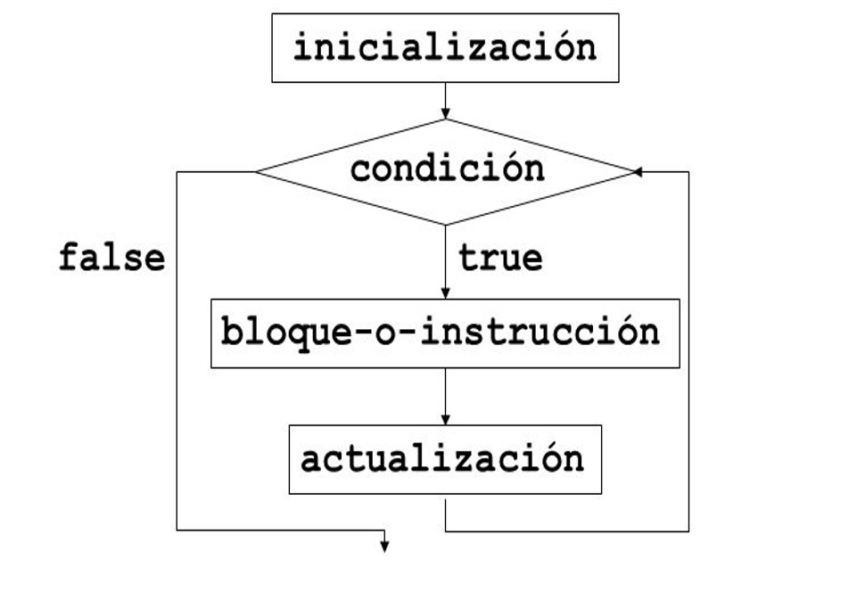

author: Equipo de instructores FDP
summary: Segunda práctica de laboratorio FDP
id: laboratorio-3B-fdp-0222
tags: workshop,iguide
categories: C
environments: Visual Studio Code
status: Published
feedback link: A link where users can go to provide feedback (e.g. the git repo or issue page)

# Fundamentos de Programación: Laboratorio 3

## Introducción


En este laboratorio se introducirá el uso de instrucciones para bucles (loops): **for** y **while**

## Conceptos básicos

Las instrucciones loop permiten ejecutar una porción de código varias veces. Cuando una cierta condición se cumple, el loop se detiene.
<br>

### Instrucciones para loops

+ <code>for</code>
+ <code>while</code>
+ <code>do while</code>

## for

### Diagrama de flujo de la instrucción for



<br><br>

Un loop con <code>for</code> sigue la siguiente sintaxis:
```c
for (inicialización ; condición ; actualización){
    //Instrucciones a ejecutar si se cumple la condición
}
    //Resto del código
```

***Ejemplo 1: Imprimir números de 0 a N***
```c
#include <stdio.h>

int main(){

    // N es un valor ingresado por el usuario
    // Aquí i contiene el valor para el inicio del for
    int N, i = 0;

    printf("Ingrese un entero: ");
    scanf("%d", &N);
    
    // for comenzará desde 0, porque declaramos i = 0
    // Dejará de hacer iteraciones cuando i
    // ya NO sea menor o igual que 0
    // i++ indica el paso (step) que avanzará el loop,
    // es decir, cuánto aumentará i
    // En este caso aumentará en 1 con cada iteración
    for(i ; i <= N ; i++){
        printf("%d ", i);
    }

    return 0;
}
```

### Consideraciones adicionales
+ El valor de inicio del for se puede declarar tanto fuera como dentro de la instrucción; en ambos casos se debe declarar como una variable, la diferencia será el scope. Por ejemplo, las siguientes formas son equivalentes:<br>

```c
int i = 0;
for(i ; i < 10; i++){

}
```

```c
int i;
for(i = 0 ; i < 10; i++){

}
```

```c
for(int i = 0 ; i < 10; i++){

}
```

+ La variable para el inicio del for puede llevar cualquier nombre, pero es bastante común el uso de la **i** como nombre.
+ El inicio del loop **NO** es obligatorio que comience en 0; puede comenzar en cualquier número, dependiendo de lo que necesitemos iterar.
+ Tampoco es obligatorio contar hacia arriba; podemos comenzar desde un límite máximo y contar hacia abajo hasta un límite mínimo.

## while

Un loop con <code>while</code> es similar a un <code>for</code>, con la diferencia de que un while seguirá iterando un número indefinido de veces hasta que la condición evaluándose deje de cumplirse.

Sigue la siguiente sintaxis:
```c
while(condición){
    // Instrucciones a ejecutarse si se cumple la condición
    // La actualización de la variable de condición
    // se debe hacer de forma manual
}
```

**Ejemplo 2: Imprimir números de 0 a N**
```c
#include <stdio.h>

int main(){

    // N es un valor ingresado por el usuario
    // Aquí i será un valor a evaluar en la condición
    int N, i = 0;

    printf("Ingrese un entero: ");
    scanf("%d", &N);
    
    // while comenzará desde 0, porque declaramos i = 0
    // Dejará de hacer iteraciones cuando i
    // ya NO sea menor o igual que 0
    // i++ indica el paso (step) que avanzará el loop,
    // es decir, cuánto aumentará i
    // En este caso aumentará en 1 con cada iteración
    while(i <= N){
        printf("%d ", i);
        i++;
    }

    return 0;
}
```

### Consideraciones adicionales

+ while no se limita a evaluar números, también puede evaluar condiciones que se utilizarían en un if.
+ La actualización de la variable evaluándose se debe actulizar manualmente (o habrá consecuencias).

## do...while

Se trata de un loop con <code>while</code>, con la diferencia de que aquí se ejecutarán las instrucciones una vez antes de evaluar si se cumple la condición.
Su sintaxis es la siguiente:
```c
do {
    // Instrucciones a ejecutarse si se cumple la condición
    // La actualización de la variable de condición
    // se debe hacer de forma manual
} while(condición);
```

### Consideraciones adicionales
Las mismas que un while.

## Errores comunes

+ En los casos de <code>for</code> y <code>while</code>, las instrucciones no se ejecutarán si la condición de inicio no se cumple. Las siguientes son algunos casos cuando no se ejecutan las instrucciones dentro del loop:
 ```c
 for(int i = 5; i < 3; i++)
 ```
 ```c
 int i = 0;
 while(i > 1){
    printf("%d ", i);
 }
 ```
+ Cuidado con los **bucles infinitos**. Si no se tiene cuidado al momento de establecer una condición, las instrucciones nunca dejarán de ejecutarse y tendremos que forzar que se detenga el programa. Las siguientes son algunas condiciones que provocarán bucles infinitos:
```c
for (int i = 1; i > 0; i++)
```
```c
int i = 1;
while(i < 5){
    printf("%d ", i);
}
```

## Ejercicios de laboratorio
1. Crear un programa que, dado un rango desde A hasta B, utilice un for para imprimir **solo** los número pares o **solo** los número impares (según la elección del usuario). Por ejemplo, los número pares en el rango de 1 a 10 se deben mostrar: 2 4 6 8 10.
2. Crear un programa que imprima la tabla de multiplicar de un número, que se detenga en un múltiplo N. Ambos números deben ser ingresados por el usuario y se debe mostrar en orden descendente. Por ejemplo, si el usuario ingresa la tabla del 2, hasta 5, se debe mostrar en pantalla lo siguiente: 2 x 5 = 10<br>2 x 4 = 8<br>2 x 3 = 6<br>2 x 2 = 4<br>2 x 1 = 2
3. Un programa que calcula la potencia de un número N. Se debe ingresar el número base y la potencia a la que se desea elevar. Por ejemplo, 2^3 es igual a 8.
4. Un juego de adivinar un número; el usuario debe establecer el número y la computadora debe adivinarlo. Para generar un número aleatorio puede utilizar la siguiente función:<br><code>srand(time(NULL))</code>, y luego almacenar un número aleatorio así: <code>int aleatorio = rand() % 10 + 1</code> (esto genera un número entre 1 y 10);