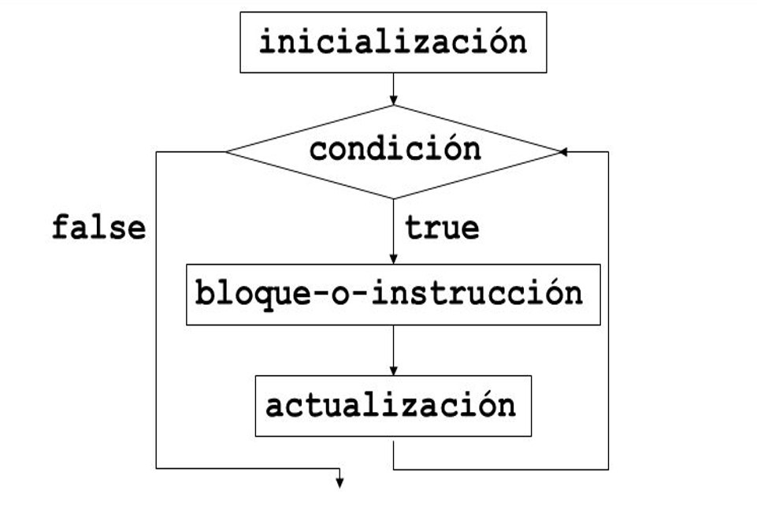

author: Equipo de instructores FDP
summary: Segunda práctica de laboratorio FDP
id: laboratorio-3-fdp-0222
tags: workshop,iguide
categories: C
environments: Visual Studio Code
status: Published
feedback link: A link where users can go to provide feedback (e.g. the git repo or issue page)

# Fundamentos de Programación: Laboratorio 3

## Introducción


En este laboratorio se introducirá el uso de instrucciones para bucles (loops): **for** y **while**

## Conceptos básicos

Las instrucciones loop permiten ejecutar una porción de código varias veces. Cuando una cierta condición se cumple, el loop se detiene.
<br>

### Instrucciones para loops

+ <code>for</code>
+ <code>while</code>
+ <code>do while</code>

## for

### Diagrama de flujo de la instrucción for



<br><br>

Un loop con <code>for</code> sigue la siguiente sintaxis:
```c
for (inicialización ; condición ; actualización){
    //Instrucciones a ejecutar si se cumple la condición
}
    //Resto del código
```

***Ejemplo 1: Imprimir números de 0 a N***
```c
#include <stdio.h>

int main(){

    // N es un valor ingresado por el usuario
    // Aquí i contiene el valor para el inicio del for
    int N, i = 0;

    printf("Ingrese un entero: ");
    scanf("%d", &N);
    
    // for comenzará desde 0, porque declaramos i = 0
    // Dejará de hacer iteraciones cuando i
    // ya NO sea menor o igual que 0
    // i++ indica el paso (step) que avanzará el loop,
    // es decir, cuánto aumentará i
    // En este caso aumentará en 1 con cada iteración
    for(i ; i <= N ; i++){
        printf("%d ", i);
    }

    return 0;
}
```

### Consideraciones adicionales
+ El valor de inicio del for se puede declarar tanto fuera como dentro de la instrucción; en ambos casos se debe declarar como una variable, la diferencia será el scope. Por ejemplo, las siguientes formas son equivalentes:<br>

```c
int i = 0;
for(i ; i < 10; i++){

}
```

```c
int i;
for(i = 0 ; i < 10; i++){

}
```

```c
for(int i = 0 ; i < 10; i++){

}
```

+ La variable para el inicio del for puede llevar cualquier nombre, pero es bastante común el uso de la **i** como nombre.
+ El inicio del loop **NO** es obligatorio que comience en 0; puede comenzar en cualquier número, dependiendo de lo que necesitemos iterar.
+ Tampoco es obligatorio contar hacia arriba; podemos comenzar desde un límite máximo y contar hacia abajo hasta un límite mínimo.

## while

Un loop con <code>while</code> es similar a un <code>for</code>, con la diferencia de que un while seguirá iterando un número indefinido de veces hasta que la condición evaluándose deje de cumplirse.

Sigue la siguiente sintaxis:
```c
while(condición){
    // Instrucciones a ejecutarse si se cumple la condición
    // La actualización de la variable de condición
    // se debe hacer de forma manual
}
```

**Ejemplo 2: Imprimir números de 0 a N**
```c
#include <stdio.h>

int main(){

    // N es un valor ingresado por el usuario
    // Aquí i será un valor a evaluar en la condición
    int N, i = 0;

    printf("Ingrese un entero: ");
    scanf("%d", &N);
    
    // while comenzará desde 0, porque declaramos i = 0
    // Dejará de hacer iteraciones cuando i
    // ya NO sea menor o igual que 0
    // i++ indica el paso (step) que avanzará el loop,
    // es decir, cuánto aumentará i
    // En este caso aumentará en 1 con cada iteración
    while(i <= N){
        printf("%d ", i);
        i++;
    }

    return 0;
}
```

### Consideraciones adicionales

+ while no se limita a evaluar números, también puede evaluar condiciones que se utilizarían en un if.
+ La actualización de la variable evaluándose se debe actulizar manualmente (o habrá consecuencias).

## do...while

Se trata de un loop con <code>while</code>, con la diferencia de que aquí se ejecutarán las instrucciones una vez antes de evaluar si se cumple la condición.
Su sintaxis es la siguiente:
```c
do {
    // Instrucciones a ejecutarse si se cumple la condición
    // La actualización de la variable de condición
    // se debe hacer de forma manual
} while(condición);
```

### Consideraciones adicionales
Las mismas que un while.

## Errores comunes

+ En los casos de <code>for</code> y <code>while</code>, las instrucciones no se ejecutarán si la condición de inicio no se cumple. Las siguientes son algunos casos cuando no se ejecutan las instrucciones dentro del loop:
 ```c
 for(int i = 5; i < 3; i++)
 ```
 ```c
 int i = 0;
 while(i > 1){
    printf("%d ", i);
 }
 ```
+ Cuidado con los **bucles infinitos**. Si no se tiene cuidado al momento de establecer una condición, las instrucciones nunca dejarán de ejecutarse y tendremos que forzar que se detenga el programa. Las siguientes son algunas condiciones que provocarán bucles infinitos:
```c
for (int i = 1; i > 0; i++)
```
```c
int i = 1;
while(i < 5){
    printf("%d ", i);
}
```

## Ejercicios de laboratorio
1. Crear un programa que utilice un for, contando desde A hasta B e indique si el número actual es par o impar.
2. Crear un programa que imprima los múltiplos de un número dado por el usuario. Por ejemplo, si el usuario ingresa 2, se deben mostrar 2, 4, 6, 8, etc.
3. Un programa que calcule 2 a la potencia N. Por ejemplo, 2^3 es igual a 8.
4. Un juego de adivinar un número generado aleatoriamente. Para generar un número aleatorio puede utilizar la siguiente función:<br><code>srand(time(NULL))</code>, y luego almacenar un número aleatorio así: <code>int aleatorio = rand() % 10 + 1</code> (esto genera un número entre 1 y 10);